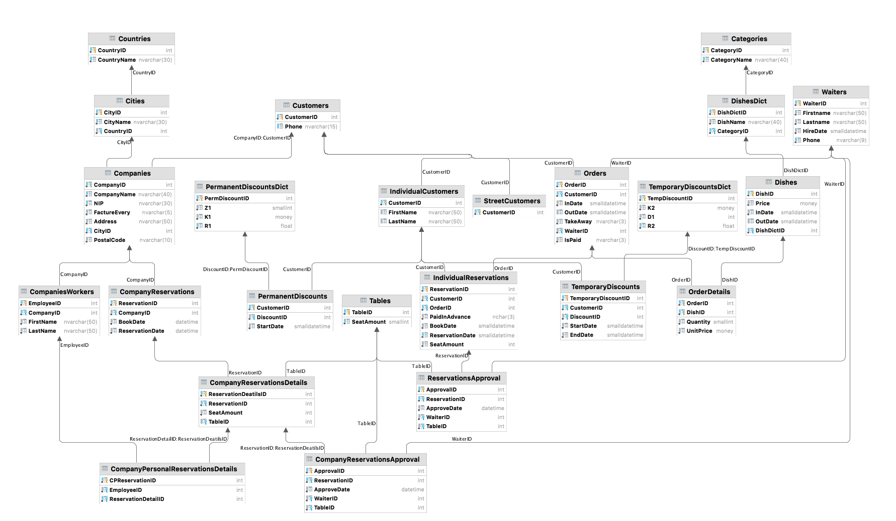

# db-restaurant-management-system
## Laboratory project for Databases course at AGH UST made with *[Marcel Spryszyński](https://github.com/MSpryszynski)

## About project
This database project was developed for managing a restaurant system. It allows users and companies to make orders or reserve tables. Personal clients are allowed to get discount which is granted automatically or by an administrator and is applied to their fure orders. All reservations have to be approved by manager, so as menu changes.

### The exact content of the task in Polish
[Task] (zadanie_2021.pdf)

### Technology
Microsoft SQL 

### Database Diagram

### Documentation with code 
*[Documentation](BazyDanychProjekt.pdf)
